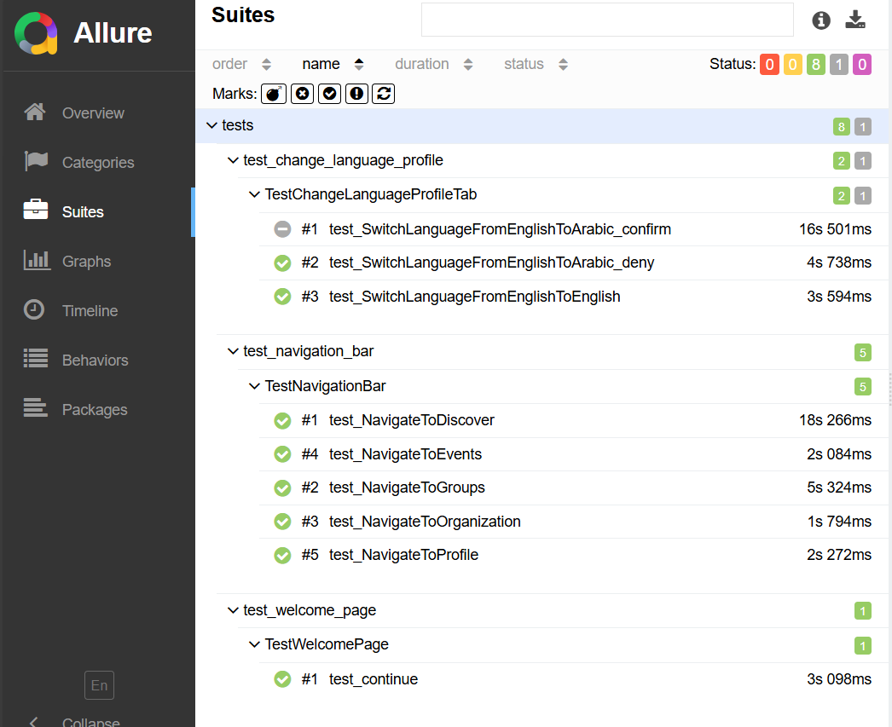

# SFA Mobile App Automated Tests Task

## Overview
This project contains automated tests for the SFA mobile app using Python, Appium, and pytest. The tests cover:

- The Navigation Bar Tests: Navigate between Profile, Groups, Events, Organizations ,and Discover tabs.
- The language switching tests: From english to arabic using the settings icone on profile screen.

The project is handling Android scripts only.


## Prerequisites
Before you can run the tests, ensure you have the following installed and set up:

- **Python 3.x**: Ensure Python is installed and added to your system's PATH.
- **pip**: Python's package installer.
- **Appium**: Install Appium via npm or using Appium Desktop.
- **Java Development Kit (JDK)**: Required for running Appium.
- **Android SDK**: Required for testing on Android devices or emulators.
- **Allure**: For generating detailed test reports.
  
## Project Structure
```
.
├── configs/                  # Configuration files
│   └── config_.py
├── pages/                    # Page object model files
│   └── ...                   
├── resources/                # Resource files (e.g., locators, data)
│   └── ...                   
├── tests/                    # Test cases
│   └── ...                   
├── allure-results/           # Directory where Allure results are stored
├── requirements.txt          # Dependencies for the project
└── README.md                 # Project documentation
```
## Installation and Running Instructions

1. **Clone the repository.**

2. **Set up a virtual environment (optional but recommended)**:
    ```bash
    python3 -m venv venv
    source venv/bin/activate  # On Windows, use `venv\Scripts\activate`
    ```
3. **Install dependencies**:
    ```bash
    pip install -r requirements.txt
    ```
4. **Run the tests**:
    ```bash
    pytest tests/
    ```
    to run test with allure results:  ``` pytest --alluredir=allure-results ```
    
5. **Running on Android**:
    - Ensure your Appium server is running.
    - Connect your Android device or start an emulator.
    - Modify the `config.py` file with the correct capabilities for your device/emulator.

## Viewing Test Reports
After running the tests, you can generate and view the Allure report:

1. Generate the report:
    ```
    allure serve allure-results
    ```
2. Open the generated report in your browser.


